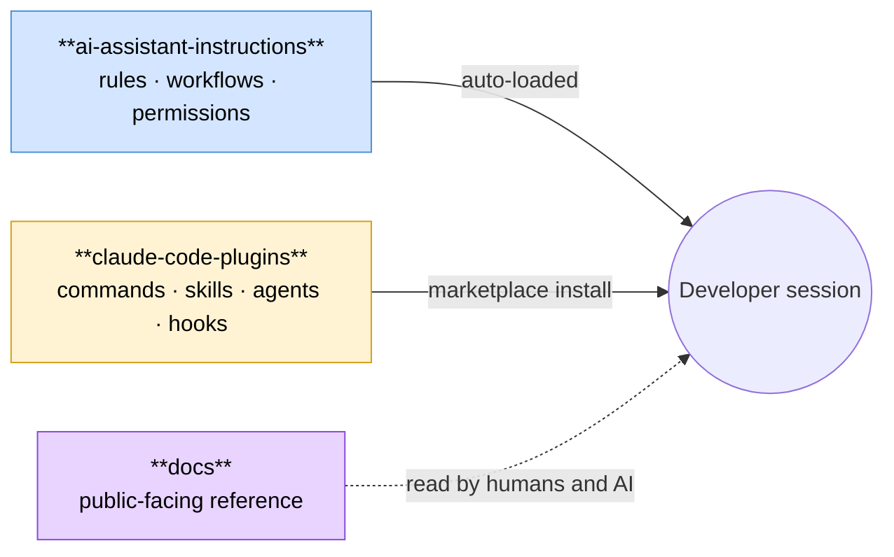

# AI Assistant Instructions

> Teaching AI assistants how to help you better. Yes, it's AI instructions written with AI assistance. We've come full circle.
>
> **Scope**: Commands, skills, agents, and hooks have been migrated to
> [JacobPEvans/claude-code-plugins](https://github.com/JacobPEvans/claude-code-plugins)
> and are delivered as portable plugins. This repository now maintains the generic pieces
> that aren't plugin-delivered: the canonical `AGENTS.md` / `CLAUDE.md` / `GEMINI.md`
> configuration, the auto-loaded rules in `agentsmd/rules/`, the 5-step development
> workflow in `agentsmd/workflows/`, the permission framework in `agentsmd/permissions/`,
> and the CI / validation tooling that keeps all of the above honest.

[![License][license-badge]][license-url]
[![Markdown Lint][markdownlint-badge]][markdownlint-url]
[![pre-commit][precommit-badge]][precommit-url]

## What Is This?

A centralized collection of instructions, workflows, and configurations for AI coding assistants.
Drop these into your projects and get consistent, high-quality AI assistance across Claude, Copilot, and Gemini.

Think of it as a style guide, but for your AI pair programmer.

### Repo boundaries

The AI configuration layer is split across three repositories. This repo owns the rules.
[`claude-code-plugins`](https://github.com/JacobPEvans/claude-code-plugins) owns commands, skills, agents, and hooks.
[`docs`](https://github.com/JacobPEvans/docs) owns the public-facing reference site at
[`docs.jacobpevans.com`](https://docs.jacobpevans.com).



Full rule, decision table, and update workflow: [`docs.jacobpevans.com/ai-development/repo-boundaries`](https://docs.jacobpevans.com/ai-development/repo-boundaries).

For the broader Nix ecosystem context and session lifecycle diagrams, see [`docs/diagrams.md`](docs/diagrams.md).

## Prerequisites

- **Git 2.30+** (for worktree support)
- **GitHub CLI** (`gh`) 2.0+ (for PR/issue management)
- **(Optional) Python 3.8+** for validation hooks
- **(Optional) Node.js 18+** for markdown linting

## Installation

```bash
# 1. Clone the repo
git clone https://github.com/JacobPEvans/ai-assistant-instructions.git

# 2. Copy AGENTS.md into your project
cp ai-assistant-instructions/AGENTS.md your-project/

#    Optional: copy the auto-loaded rules too
mkdir -p your-project/agentsmd
cp -r ai-assistant-instructions/agentsmd/rules your-project/agentsmd/

# 3. Create vendor symlinks so each AI tool reads the same source
cd your-project
ln -sf AGENTS.md CLAUDE.md
ln -sf AGENTS.md GEMINI.md

# 4. Install the plugins from JacobPEvans/claude-code-plugins
#    (commands, skills, agents, and hooks live there, not here)
claude marketplace add JacobPEvans/claude-code-plugins
claude plugin install git-workflows github-workflows git-standards

# 5. Verify setup
claude doctor
```

Or just browse the [documentation](docs/) and cherry-pick what you need.

## Usage

Once installed, the AI assistants read `CLAUDE.md` / `AGENTS.md` / `GEMINI.md`
automatically at session start, and the auto-loaded rules in `agentsmd/rules/`
are pulled in for every session. Plugin-delivered commands and skills from
[JacobPEvans/claude-code-plugins](https://github.com/JacobPEvans/claude-code-plugins)
are invoked via slash commands (`/refresh-repo`, `/finalize-pr`, `/ship`, etc.)
or directly by name.

See the [5-step workflow](#the-5-step-workflow) below for the expected
development loop, and [AGENTS.md](AGENTS.md) for the full set of rules,
routing decisions, and on-demand standards.

## Directory Structure

```text
.
├── AGENTS.md                  # Canonical configuration (CLAUDE.md / GEMINI.md are symlinks)
├── agentsmd/
│   ├── rules/                 # Auto-loaded universal and path-scoped rules
│   ├── workflows/             # The 5-step development workflow
│   ├── permissions/           # Permission framework (allow / ask / deny JSON configs)
│   └── docs/                  # Permission and workflow support docs
├── .claude/rules              # Symlink → agentsmd/rules
├── .copilot/instructions.md   # Symlink → AGENTS.md
├── .gemini/config.yaml        # Gemini-specific config
├── scripts/                   # Validation helpers (token limits, permissions, links)
└── .github/workflows/         # CI gates (markdown, spellcheck, link check, CodeQL, release-please)
```

Claude-Code plugins (commands, skills, agents, hooks) live in
[JacobPEvans/claude-code-plugins](https://github.com/JacobPEvans/claude-code-plugins)
and are consumed via the `git-workflows`, `github-workflows`, `git-standards`,
`code-standards`, `infra-standards`, `project-standards`, `ai-delegation`,
`config-management`, `content-guards`, `git-guards`, `script-guards`,
`codeql-resolver`, and `session-analytics` plugins (among others).

## Supported AI Assistants

| Assistant | Integration | Notes |
| --------- | ----------- | ----- |
| **Claude** | `.claude/` directory | Full command support via Claude Code |
| **GitHub Copilot** | `.github/copilot-instructions.md` + prompts | Works in VS Code, GitHub.com, Visual Studio |
| **Gemini** | `.gemini/` directory | Style guide and config support |

## The 5-Step Workflow

This repo centers on a rigorous development workflow:

1. **Research & Explore** - Understand before you code
2. **Plan & Document** - Write the "what" and "why" before the "how"
3. **Define Success & PR** - Set acceptance criteria upfront
4. **Implement & Verify** - Build with tests, verify as you go
5. **Finalize & Commit** - Clean commits, passing CI

Full details in [`agentsmd/workflows/`](agentsmd/workflows/).

## Plugin-delivered commands, skills, agents, and hooks

All slash commands, skills, agents, and hooks previously listed in this README
now ship as plugins in
[JacobPEvans/claude-code-plugins](https://github.com/JacobPEvans/claude-code-plugins).
Install the marketplace and enable the plugins you need:

| Plugin | Provides |
| --- | --- |
| `git-workflows` | `/refresh-repo`, `/sync-main`, `/rebase-pr`, `/troubleshoot-*` |
| `github-workflows` | `/finalize-pr`, `/squash-merge-pr`, `/ship`, `/resolve-pr-threads`, `/shape-issues`, `/trigger-ai-reviews` |
| `git-standards` | `/git-workflow-standards`, `/pr-standards` |
| `code-standards` | `/code-quality-standards`, `/review-standards` |
| `infra-standards` | `/infrastructure-standards` |
| `project-standards` | `/agentsmd-authoring`, `/workspace-standards`, `/skills-registry` |
| `ai-delegation` | `/delegate-to-ai`, `/auto-maintain` |
| `config-management` | `/sync-permissions`, `/quick-add-permission` |
| `codeql-resolver` | `/resolve-codeql` + specialist agents |
| `session-analytics` | `/token-breakdown` |
| `content-guards`, `git-guards`, `script-guards`, `pr-lifecycle`, `pal-health`, `process-cleanup` | PreToolUse / PostToolUse / Stop hooks — invoked automatically |

See [AGENTS.md](AGENTS.md) for the full on-demand standards table and the
auto-loaded rules reference.

## Core Concepts

The documentation covers:

- **Code Standards** - Consistency across languages
- **Documentation Standards** - AI-friendly markdown
- **Infrastructure Standards** - Terraform/Terragrunt patterns
- **Permission System** - How AI tool permissions integrate with nix-config
- **DRY Principle** - Why everything symlinks to one place
- **Memory Bank** - Maintaining AI context across sessions
- **Remote Commit Workflow** - Making commits via GitHub API without local clone

Browse [`agentsmd/rules/`](agentsmd/rules/) and [`agentsmd/docs/`](agentsmd/docs/).

**Advanced**: This repo integrates with
[nix-config](https://github.com/JacobPEvans/nix) for unified permission
management across AI tools. This is **optional** - the basic setup works
standalone. See [`agentsmd/docs/permission-system.md`](agentsmd/docs/permission-system.md)
for details.

## Need Help?

- [Codex Quick Start](docs/codex-quick-start.md) - repo analysis, prompt patterns, and Codex parity backlog
- 📖 [Documentation Home](docs/) - Getting started guides and references
- 🐛 [Issues](https://github.com/JacobPEvans/ai-assistant-instructions/issues) - Report bugs or request features

## Contributing

Contributions welcome. See [CONTRIBUTING.md](CONTRIBUTING.md) for the details, though the short version
is: open a PR, don't be a jerk, and I'll probably merge it.

## Security

Found a vulnerability? Please report it responsibly. See [SECURITY.md](SECURITY.md) for details.

## License

[Apache 2.0](LICENSE) - Use it, modify it, just keep the attribution.

---

*Built by a human, refined by AI, used by both.*

[license-badge]: https://img.shields.io/badge/License-Apache_2.0-blue.svg
[license-url]: LICENSE
[markdownlint-badge]: https://github.com/JacobPEvans/ai-assistant-instructions/actions/workflows/markdownlint.yml/badge.svg
[markdownlint-url]: https://github.com/JacobPEvans/ai-assistant-instructions/actions/workflows/markdownlint.yml
[precommit-badge]: https://img.shields.io/badge/pre--commit-enabled-brightgreen?logo=pre-commit
[precommit-url]: https://github.com/pre-commit/pre-commit
