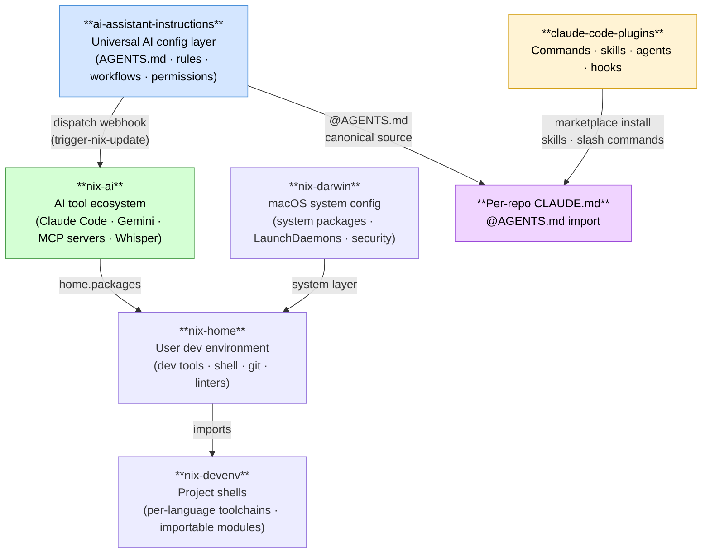
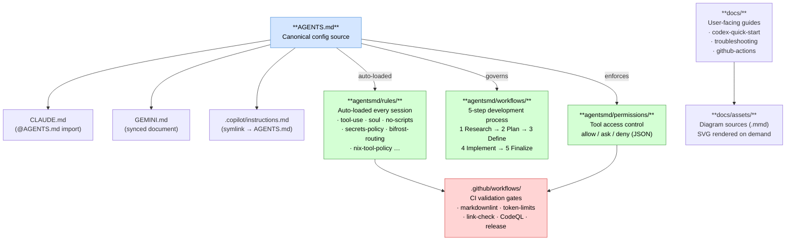
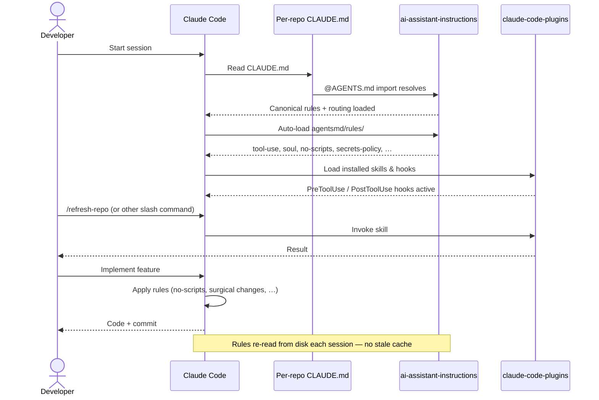

# Architecture Diagrams

## Ecosystem Context

Where `ai-assistant-instructions` fits within the broader JacobPEvans nix-ai system.



Source: [`docs/assets/ecosystem.mmd`](assets/ecosystem.mmd)

---

## Repository Architecture

Internal structure of this repository and how the pieces relate.



Source: [`docs/assets/architecture.mmd`](assets/architecture.mmd)

---

## AI Agent Session Lifecycle

Sequence of events from session start through implementation for a Claude Code session.



Source: [`docs/assets/session-lifecycle.mmd`](assets/session-lifecycle.mmd)

---

To render `.mmd` sources to SVG locally:

```bash
nix run nixpkgs#mermaid-cli -- -i docs/assets/ecosystem.mmd -o docs/assets/ecosystem.svg
```
